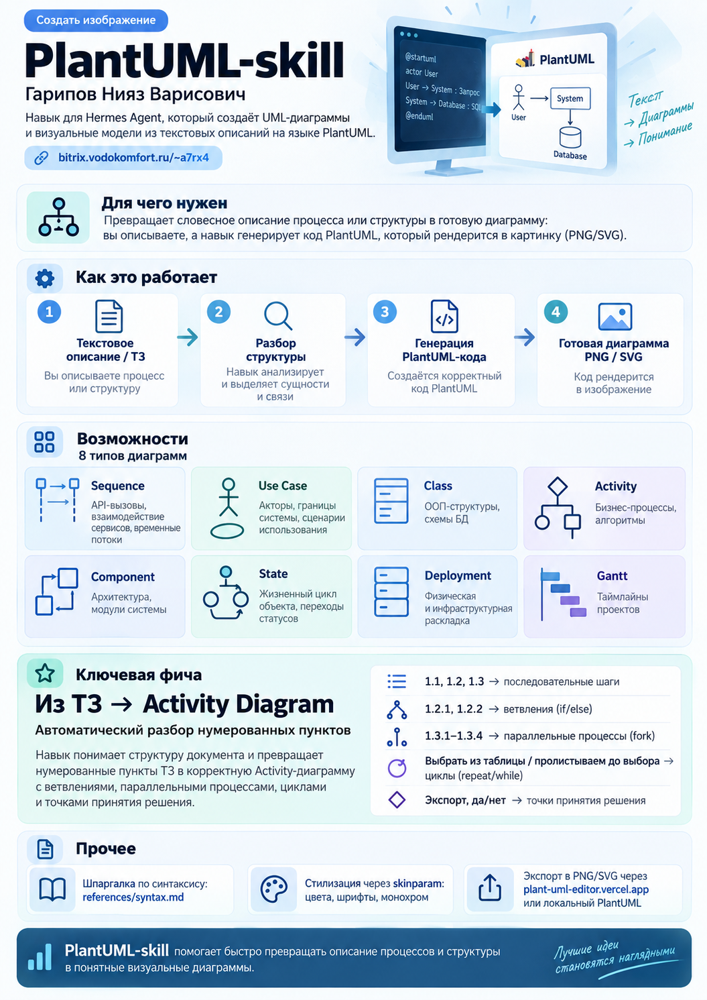

# PlantUML Skill

Create professional UML diagrams from text descriptions using PlantUML syntax.

## Features

- 8 diagram types: Sequence, Use Case, Class, Activity, Component, State, Deployment, Gantt
- TZ-to-Activity-Diagram: turn a numbered specification into an Activity diagram automatically
- Syntax reference in `references/syntax.md`
- Render via https://plant-uml-editor.vercel.app/ or local PlantUML, export PNG/SVG

## Install

Import `plantuml-skill.skill` into Hermes Agent, or copy `SKILL.md` + `references/` into your skills directory.
