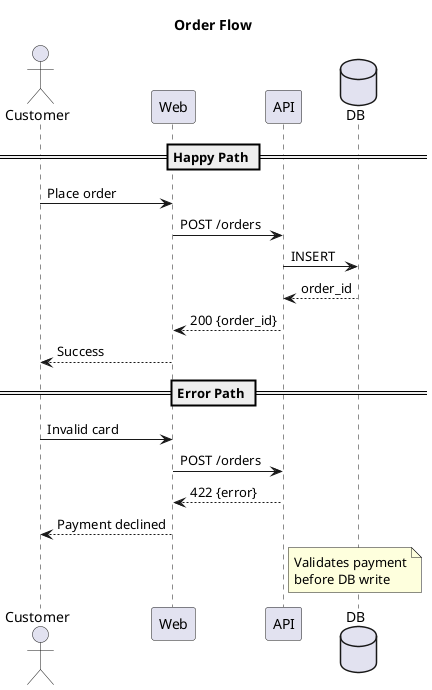
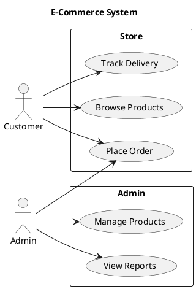
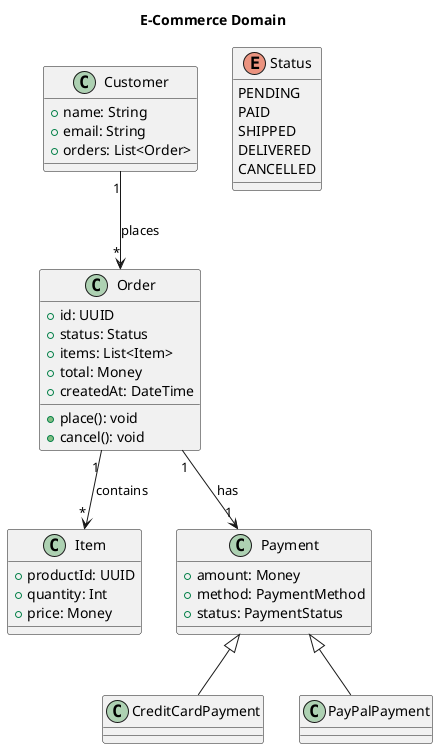
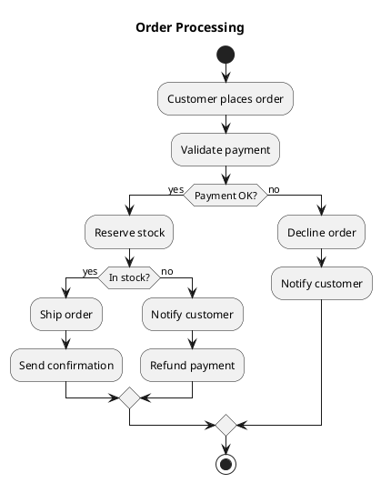
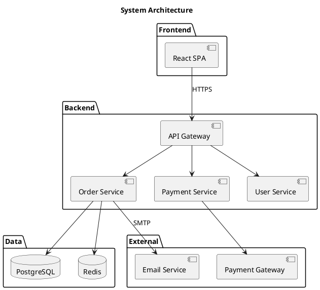
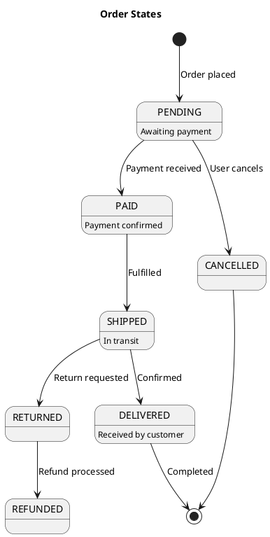
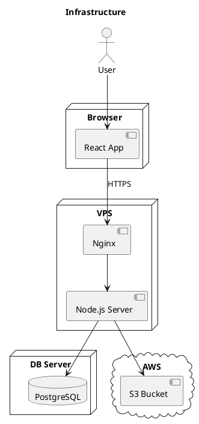
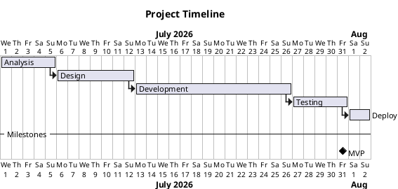

# PlantUML Syntax Reference

## General
All diagrams start with `@startuml` and end with `@enduml` (or `@startgantt`/`@endgantt` for Gantt).

## 1. Sequence Diagram



Key syntax:
- `->` solid arrow (call)
- `-->` dashed arrow (return)
- `->>` async call
- `participant`, `actor`, `database`, `boundary`, `control`, `entity`, `collections`
- `== title ==` separator
- `note left/right of X: text`
- `alt/else/end` for conditions
- `loop N times/end` for loops
- `group label/end` for grouping
- `activate/deactivate X` for activation bars
- `|||` pause
- `destroy X` to end lifeline

## 2. Use Case Diagram



Key syntax:
- `actor` — actor
- `usecase` — use case (or just text in parens)
- `rectangle/lipackage` — system boundary
- `-->` — association
- `<|--` — generalization (inheritance)
- `left to right direction` — horizontal layout

## 3. Class Diagram



Key syntax:
- `class X {}` — with fields/methods inside
- `+` public, `#` protected, `-` private
- `<|--` inheritance
- `*--` composition
- `o--` aggregation
- `-->` association
- `..>` dependency
- `interface X {}`
- `abstract class X {}`
- `enum X {}`
- Multiplicity: `"1"`, `"*"`, `"0..*"`, `"1..*"`

## 4. Activity Diagram



Key syntax:
- `start` / `stop` / `end`
- `:action;` — activity
- `if (cond) then (yes)/else (no)/endif` — branching
- `while (cond) is (body)/endwhile` — loops
- `repeat/while (cond) is (body)` — repeat-until
- `fork/end fork` — parallel
- `|#FF0000|` — color
- `partition` — swimlane
- `note right: text`
- `detach` / `kill`

## 5. Component Diagram



Key syntax:
- `[component]`
- `database "name"`
- `package "name" {}`
- `interface "name"`
- `-->` — connection
- `..>` — dependency

## 6. State Diagram



Key syntax:
- `[*]` — start/end state
- `-->` — transition
- `:State description`
- `state "Name" as alias {}` — composite states
- `fork/end fork` — concurrent regions
- `hide empty description`

## 7. Deployment Diagram



Key syntax:
- `actor`, `node`, `cloud`, `database`, `queue`
- `folder`, `frame`, `artifact`, `component`
- Can nest nodes inside other nodes

## 8. Gantt Chart



Key syntax:
- `@startgantt` / `@endgantt`
- `[task] lasts N days`
- `[task2] starts at [task1]'s end`
- `-- separator --`
- `[milestone] happens at date`
- `{start}`, `{end}` for constraints
- Colors: `[#Red] task`

## Styling (skinparam)

```plantuml
skinparam backgroundColor Azure
skinparam componentStyle rectangle
skinparam defaultFontName Arial
skinparam defaultFontSize 12
skinparam arrowColor Blue
skinparam actorBorderColor Black
skinparam packageBackgroundColor White
```

Common skinparams:
- `backgroundColor`
- `componentStyle` — `rectangle` or `uml2`
- `monochrome true` — black and white
- `shadowing false` — disable shadows
- `roundcorner N` — corner radius
- `sequenceMessageAlign center/left/right`
- `maxMessageSize N`
- `titleFontSize N`
- `titleFontName Font`
